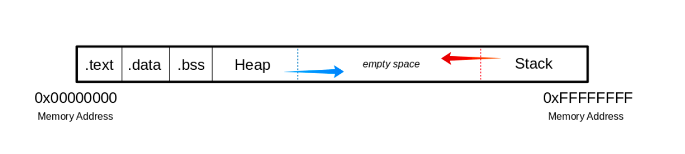
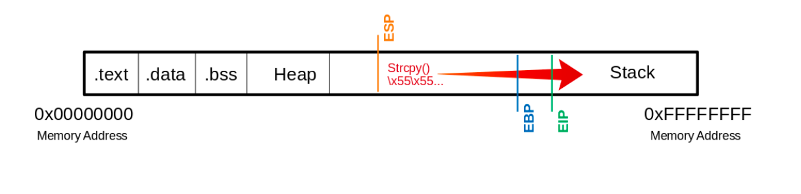

# Memory Layout At A Glance

| Memory Segment | Details |
| -------------- | ------- |
| .text          | Executable Code (Read Only) |
| .data          | Initialized Global and Static Variables |
| .bss          | Uninitialized Global and Static Variables |
| heap | Dynamically Allocated Memory using `malloc()` (Low to High) |
| stack | Function Paramters, Local Variables and Return Addresses during Program Execution (High to Low) |


# Visualization with An Image



# Memory Protection

| Method | Full Form | Purpose | Bypass
| -- | -- | -- | -- |
| DEP | Data Execution Protection | Making Certain Areas of Memory (For example, Stack) Read-Only to prevent malicious execution of shellcode | Using ROP (Return Oriented Programming) to upload Shellcode to Executable Memory |
| ASLR | Address Space Layout Randomization | Randomizing Memory Address to Make ROP Difficult | Leaking Memory Address

# Vulnerable C Functions
- strcpy
- gets
- sprintf
- scanf
- strcat

# GDB - Change Disassembly Flavor to Intel
```bash
(gdb) set disassembly-flavor intel
```

# Take Control of the EIP
# Step 1: Cause Segmentation Fault
## Run Python Inside GDB to Cause Segmentation Fault
```bash
student@nix-bow:~$ gdb -q bow32

(gdb) run $(python -c "print '\x55' * 1200")
```

## Visualization of Payload Execution

 

## See later
Reverse Debugging