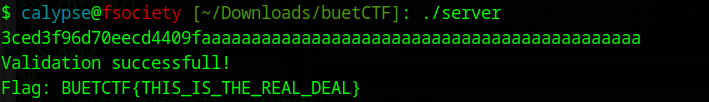

# Introduction
This problem is taken from [Inter University Capture The Flag Competition | BUET CSE Fest 2024](https://github.com/buetsec/buet-ctf-2024-preliminary/tree/main) organized by 
[BUET Cyber Security Club](https://github.com/buetsec)

# Downloadable Challenge
[Challenge](./chal.zip)

# Anatomy of The Challenge
There are two binary files
- Client
- Server

The Client file surves as a distraction. It just connects to the remote server to fetch the flag. Our main concern is the `server` file since it contains the license key, which will later be fed into the `client` file to fetch the flag.

# Ghidra Decompilation of Server

```C

undefined8 main(void)

{
  char isRegistered;
  size_t strlen;
  char *env;
  long in_FS_OFFSET;
  char usr_input [136];
  long local_10;
  
  local_10 = *(long *)(in_FS_OFFSET + 0x28);
  env = fgets(usr_input,100,stdin);
  if (env == (char *)0x0) {
    fwrite("Failed to read input\n",1,0x15,stderr);
  }
  strlen = strcspn(usr_input,"\n");
  usr_input[strlen] = '\0';
  isRegistered = validate_sha(usr_input);
  if (isRegistered == '\0') {
    printf("The license is not registered or invalid.");
  }
  else {
    env = getenv("FLAG");
    if (env == (char *)0x0) {
      printf(
            "Flag not found.\nIf debugging in a local environment, make sure the FLAG environment va riable is set.\nIf running against a remote server, contact the admin asap."
            );
    }
    else {
      printf("Validation successfull!\nFlag: %s\n",env);
    }
  }
  if (local_10 != *(long *)(in_FS_OFFSET + 0x28)) {
                    /* WARNING: Subroutine does not return */
    __stack_chk_fail();
  }
  return 0;
}
```

I renamed serveral variables to make the code more readable. Here `usr_input` is passed to the `validate_sha()` function which is the main culprit when it comes to validating the license key. Let's take a peek into the function.

# Decompiled validate_sha()
```C
undefined8 validate_sha(char *usr_input)

{
  int iVar1;
  size_t strlen;
  undefined8 uVar2;
  undefined4 extraout_var;
  int i;
  
  strlen = ::strlen(usr_input);
  if (strlen == 64) {
    for (i = 0; i < 64; i = i + 1) {
      if (((usr_input[i] < 'a') || ('f' < usr_input[i])) &&
         ((usr_input[i] < '0' || ('9' < usr_input[i])))) {
        return 0;
      }
    }
    iVar1 = strncmp(usr_input,"3ced3f96d70eecd4409f",0x14);
    uVar2 = CONCAT71((int7)(CONCAT44(extraout_var,iVar1) >> 8),iVar1 == 0);
  }
  else {
    uVar2 = 0;
  }
  return uVar2;
}
```

So the `usr_input` or the license key must be exactly 64 characters long and every character must lie within the range of `a`-`f` and `0`-`9`. The function only accepts hexadecimal strings, which aligns with the format of a `SHA1` hash.

 Then the function compares the first `0x14` or 20 characters of the `usr_input` with `"3ced3f96d70eecd4409f"`. Since we need to pass a 64 char long string, we will pad the rest of the `usr_input` using a lot of `a`'s. 
 
 Let's run a simple python command for that:
 
 ```python
 >>> 64-20
44
>>> "3ced3f96d70eecd4409f"+44*'a'
'3ced3f96d70eecd4409faaaaaaaaaaaaaaaaaaaaaaaaaaaaaaaaaaaaaaaaaaaa'
```

We will pass the string to the `server` binary. But before we do, we must set an environment variable `FLAG` to test the program. 
We will run the following bash command to set the environment variable:
```bash
export FLAG="BUETCTF{THIS_IS_THE_REAL_DEAL}"
```

This is just a sample flag I set up for testing purposes.



And Bingo! We successfully cracked the program. If we were participating in the live CTF, we would use a sample `name` and the `license key` `'3ced3f96d70eecd4409faaaaaaaaaaaaaaaaaaaaaaaaaaaaaaaaaaaaaaaaaaaa'` to fetch the flag.


