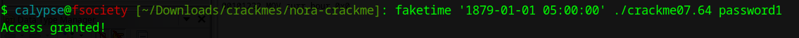

# Ghidra Decompilation
## Main()
```C
undefined8 main(int param_1,char **param_2)

{
  int iVar1;
  int iVar2;
  
  if (param_1 != 2) goto LAB_001012ac;
  iVar1 = cur_hour();
  iVar2 = strncmp(param_2[1],"password1",9);
  if (iVar2 == 0) {
    if (1 < iVar1 - 5U) {
      fail();
      goto LAB_00101298;
    }
  }
  else {
LAB_00101298:
    fail();
  }
  succeed();
LAB_001012ac:
  puts("Need exactly one argument.");
  return 0xffffffff;
}
```

## curr_hour()
```C
int cur_hour(void)

{
  int curr_hour;
  int *piVar1;
  tm *ptVar2;
  char *pcVar3;
  time_t curr_time;
  
  time(&curr_time);
  piVar1 = __errno_location();
  if (*piVar1 == 0) {
    ptVar2 = localtime(&curr_time);
    if (*piVar1 == 0) {
      curr_hour = ptVar2->tm_hour;
    }
    else {
      pcVar3 = strerror(*piVar1);
      printf("ERROR: Could not get time: %s",pcVar3);
      curr_hour = -1;
    }
  }
  else {
    pcVar3 = strerror(*piVar1);
    printf("ERROR: Could not get time: %s",pcVar3);
    curr_hour = -1;
  }
  return curr_hour;
}
```

So curr_hour() basically fetches the current hour. The interesting piece of code is `if (1 < iVar1 - 5U)` in `main()`.

```
1 < iVar1 - 5U
=> |iVar1-5| > 1
(+)-> iVar1-5 > 1 => iVar1>6
(-)-> -iVar1+5 > 1 => -iVar1 > -4 => iVar1 < 4
```

So it evalulates to `if((iVar1 < 4) || (iVar > 6))`

So our current hour must be 5 and the commandline argument must be `password1` to crack the challenge

In order to fake our current time, we can use the tool `faketime` 

```bash
sudo apt install faketime
```

Let's exploit the program
```bash
faketime '1879-01-01 05:00:00' ./crackme07.64 password1
```

# Last Demonstration
