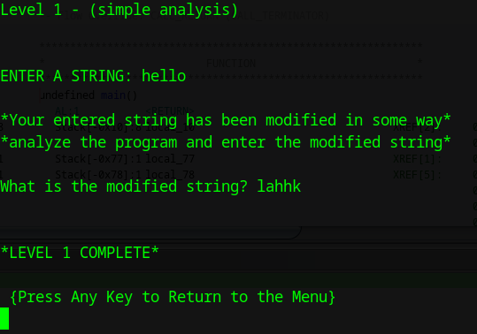

# Link to the Crackme Challenge
[Challenge](https://crackmes.one/crackme/66c724b9b899a3b9dd02ad98)

# Level 1
## Ghidra Decompilation
```C 
void FUN_00101456(void)

{
  int iVar1;
  size_t strlen;
  long in_FS_OFFSET;
  int i;
  byte usr_input [32];
  char modified_usr_input [24];
  long local_20;
  
  local_20 = *(long *)(in_FS_OFFSET + 0x28);
  printf("\x1b[H\x1b[J");
  printf("Level 1 - (simple analysis)\n\n\nENTER A STRING: ");
  fgets((char *)usr_input,0x15,stdin);
  strlen = strcspn((char *)usr_input,"\n");
  usr_input[strlen] = 0;
  i = 0;
  while( true ) {
    strlen = ::strlen((char *)usr_input);
    if (strlen <= (ulong)(long)i) break;
    usr_input[i] = usr_input[i] ^ 4;
    i = i + 1;
  }
  puts(
      "\n*Your entered string has been modified in some way*\n*analyze the program and enter the mod ified string*\n"
      );
  printf("What is the modified string? ");
  fgets(modified_usr_input,0x15,stdin);
  strlen = strcspn(modified_usr_input,"\n");
  modified_usr_input[strlen] = '\0';
  iVar1 = strcmp(modified_usr_input,(char *)usr_input);
  if (iVar1 == 0) {
    puts("\n\n*LEVEL 1 COMPLETE*\n\n {Press Any Key to Return to the Menu}");
    getchar();
  }
  else {
    puts("\n\n*LEVEL 1 FAILED TRY AGAIN*");
    sleep(1);
    FUN_00101456();
  }
  if (local_20 != *(long *)(in_FS_OFFSET + 0x28)) {
                    /* WARNING: Subroutine does not return */
    __stack_chk_fail();
  }
  return;
}
```

This function handles the mechanism of level 1. The program basically collects a string from the user and then performs an XOR encryption with the key 4 and runs a validation check against the second input(modified string) from the user. So we can just write a simple python script to find the modified string of any arbitrary string.

```python
usr = "hello"
mod = ""
for i in range(len(usr)):
    mod += (chr(ord(usr[i]) ^ 4))
print(mod) #lahhk
```



Level 1 COMPLETED!