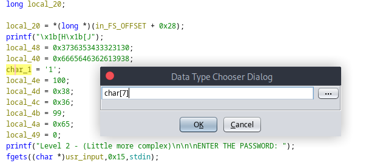
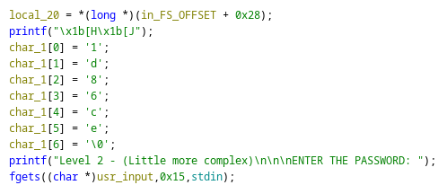
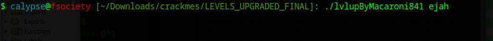
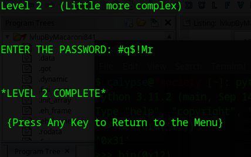

# Link to the Crackme Challenge
[Challenge](https://crackmes.one/crackme/66c724b9b899a3b9dd02ad98)

# Level 2
## Ghidra Decompilation
```C
void FUN_001015ca(long param_1)

{
  int iVar1;
  size_t strlen;
  long in_FS_OFFSET;
  int i;
  char char_1;
  undefined local_4e;
  undefined local_4d;
  undefined local_4c;
  undefined local_4b;
  undefined local_4a;
  undefined local_49;
  undefined8 local_48;
  undefined8 local_40;
  byte usr_input [24];
  long local_20;
  
  local_20 = *(long *)(in_FS_OFFSET + 0x28);
  printf("\x1b[H\x1b[J");
  local_48 = 0x3736353433323130;
  local_40 = 0x6665646362613938;
  char_1 = '1';
  local_4e = 100;
  local_4d = 0x38;
  local_4c = 0x36;
  local_4b = 99;
  local_4a = 0x65;
  local_49 = 0;
  printf("Level 2 - (Little more complex)\n\n\nENTER THE PASSWORD: ");
  fgets((char *)usr_input,0x15,stdin);
  strlen = strcspn((char *)usr_input,"\n");
  usr_input[strlen] = 0;
  i = 0;
  while( true ) {
    strlen = ::strlen((char *)usr_input);
    if (strlen <= (ulong)(long)i) break;
    usr_input[i] = usr_input[i] ^ 0x12;
    usr_input[i] = (char)i + usr_input[i];
    i = i + 1;
  }
  if (((*(long *)(param_1 + 8) != 0) && (**(char **)(param_1 + 8) != '\0')) &&
     (**(char **)(param_1 + 8) == 'e')) {
    iVar1 = strcmp((char *)usr_input,&char_1);
    if (iVar1 == 0) {
      puts("\n\n*LEVEL 2 COMPLETE*\n\n {Press Any Key to Return to the Menu}");
      getchar();
      goto code_r0x00101773;
    }
  }
  puts("*LEVEL 2 FAILED TRY AGAIN*");
  sleep(1);
  FUN_001015ca(param_1);
code_r0x00101773:
  if (local_20 != *(long *)(in_FS_OFFSET + 0x28)) {
                    /* WARNING: Subroutine does not return */
    __stack_chk_fail();
  }
  return;
}
```

Some of you, especially those who are starting out, might find the decompiled code puzzling. Let's try to understand each portion step by step.

The program asks for an input from an user and then performs an XOR encryption of each character with the key `0x12` and finally adds the index of the current element to the encrypted character. That looks easy but you might find the next portion a little difficult to understand.

```C
if (((*(long *)(param_1 + 8) != 0) && (**(char **)(param_1 + 8) != '\0')) &&
     (**(char **)(param_1 + 8) == 'e'))
```

Here, `param_1` is the parameter passed to the function, which is a commandline argument given by the user. More specifically, we are dealing with a pointer here. `param_1+8` refers to a memory block of 8 bytes. 

First, we are dereferncing the pointer once and checking if points to NULL using  `(*(long *)(param_1 + 8) != 0)`

Next, we are dereferncing the pointer twice. Dereferencing the first time, we get a memory address of a string and the second time, we receive the first character and checking whether it's a NULL byte or `\0` using `(**(char **)(param_1 + 8) != '\0'))`

In the last comparison, we check if the first character is `'e'`. If the validation is passed, only then we will perform the next validation check, which is a string comparsion using `strcmp()`:

`iVar1 = strcmp((char *)usr_input,&char_1);`

It may look like the first character of our user input is being validated against `char_` but in reality, `char_1` is actually a string and we are running a check against that string.

Let's look at the stack layout for better insight:
```
                             **************************************************************
                             *                          FUNCTION                          *
                             **************************************************************
                             undefined FUN_001015ca()
             undefined         AL:1           <RETURN>                                XREF[1]:     00101689(W)  
             undefined8        RAX:8          strlen                                  XREF[1]:     00101689(W)  
             undefined8        Stack[-0x10]:8 local_10                                XREF[1]:     00101787(R)  
             undefined8        Stack[-0x20]:8 local_20                                XREF[2]:     001015e4(W), 
                                                                                                   00101773(R)  
             undefined1[24]    Stack[-0x38]   usr_input                               XREF[4]:     00101667(*), 
                                                                                                   00101678(*), 
                                                                                                   001016da(*), 
                                                                                                   00101724(*)  
             undefined8        Stack[-0x40]:8 local_40                                XREF[2,3]:   00101616(W), 
                                                                                                   00101628(R), 
                                                                                                   00101636(R), 
                                                                                                   00101621(R), 
                                                                                                   0010163d(R)  
             undefined8        Stack[-0x48]:8 local_48                                XREF[1,2]:   00101612(W), 
                                                                                                   0010161a(R), 
                                                                                                   0010162f(R)  
             undefined1        Stack[-0x49]:1 local_49                                XREF[1]:     00101644(W)  
             undefined1        Stack[-0x4a]:1 local_4a                                XREF[1]:     00101641(W)  
             undefined1        Stack[-0x4b]:1 local_4b                                XREF[1]:     0010163a(W)  
             undefined1        Stack[-0x4c]:1 local_4c                                XREF[1]:     00101633(W)  
             undefined1        Stack[-0x4d]:1 local_4d                                XREF[1]:     0010162c(W)  
             undefined1        Stack[-0x4e]:1 local_4e                                XREF[1]:     00101625(W)  
             undefined1        Stack[-0x4f]:1 char_1                                  XREF[2]:     0010161e(W), 
                                                                                                   00101720(*)  
             undefined4        Stack[-0x54]:4 i                                       XREF[8]:     00101693(W), 
                                                                                                   0010169c(R), 
                                                                                                   001016ab(R), 
                                                                                                   001016b4(R), 
                                                                                                   001016c0(R), 
                                                                                                   001016c7(R), 
                                                                                                   001016d0(RW), 
                                                                                                   001016d4(R)  
             undefined1        Stack[-0x55]:1 local_55                                XREF[2]:     00101648(W), 
                                                                                                   0010171b(R)  
             undefined8        Stack[-0x60]:8 local_60                                XREF[5]:     001015d7(W), 
                                                                                                   001016eb(R), 
                                                                                                   001016fb(R), 
                                                                                                   0010170d(R), 
                                                                                                   00101766(R)  
                             FUN_001015ca                                    XREF[4]:     0010176d(c), 
                                                                                          FUN_00102da1:00102dfe(c), 
                                                                                          001042ac, 001043cc(*)  
        001015ca f3 0f 1e fa     ENDBR64
```

It looks like there are 7 bytes starting from `char_1`. Let's make a string out of the 7 bytes by hitting `Ctrl+L` on `char_1` and renaming the data type as `char[7]`




The last byte is `\0`, which is the string terminator, meaning we were right to assume it a string of 7 characters.

Let's rename `char_1` as `encrypted_password`:

```C
  encrypted_password[0] = '1';
  encrypted_password[1] = 'd';
  encrypted_password[2] = '8';
  encrypted_password[3] = '6';
  encrypted_password[4] = 'c';
  encrypted_password[5] = 'e';
  encrypted_password[6] = '\0';
```

So the encrypted password is `1d86ce`.

So let's write a script to decrypt the original password:
```python
encrypted_password = "1d86ce"
tmp = ""
password = ""
for i in range(len(encrypted_password)):
    tmp += chr(ord(encrypted_password[i]) - i)
    password += chr(ord(tmp[i]) ^ 0x12)

print(password)
```

The password is `#q$!Mr`

Let's try it out:




We passed a random argument starting with `e` to the program and selecting level 2, we entered the password generated from the python script, which led us to the success message. 

Thank you for having your patience to follow me throughout the whole guide.