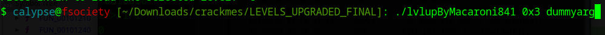
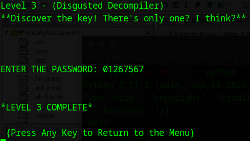

# Link to the Crackme Challenge
[Challenge](https://crackmes.one/crackme/66c724b9b899a3b9dd02ad98)

# Level 3
This challenge is a little bit tricky. The author has created a lot of unnecessary variable to confuse crackers like us. But we will not be tricked and solve the challenge by any means.

Here, we should focus on two aspects while detecting the necessary variables:
- Variables that are part of a condition/validation check
- Variables that are part of a loop

Keeping that philosophy at heart, we should play around with the variables. A lot of strings are broken into chunks. There is an easy way to retrieve the whole string. If a large number of bytes are followed by 1 single byte in the stack layout, there is a high chance that it is a string. We should change the data type of the combination of variables that we suspect as a string and if we are right, we will find out that the last byte or the last index of that string is a null byte or `\0`, which is the null terminator of a C string.

# Ghidra Decompilation
```C


/* WARNING: Removing unreachable block (ram,0x00101d73) */

void FUN_0010178d(long param_1,int param_2)

{
  int iVar1;
  size_t sVar2;
  long in_FS_OFFSET;
  char andromida [9];
  int i;
  char local_dd [4];
  char solar [5];
  undefined4 local_d4;
  undefined2 local_d0;
  undefined4 local_ce;
  undefined2 local_ca;
  undefined local_c8;
  undefined4 local_c7;
  char local_c3;
  undefined uStack_c2;
  undefined local_c1;
  char local_c0 [9];
  undefined6 uStack_b6;
  char usr_input [21];
  char crime [68];
  long local_10;
  bool flag_bit;
  
  local_10 = *(long *)(in_FS_OFFSET + 0x28);
  flag_bit = true;
  local_d4 = 0x31643452;
  local_d0 = 0x78;
  usr_input[0] = '\0';
  usr_input[1] = '\0';
  usr_input[2] = '\0';
  usr_input[3] = '\0';
  usr_input[4] = '\0';
  usr_input[5] = '\0';
  usr_input[6] = '\0';
  usr_input[7] = '\0';
  usr_input[8] = '\0';
  usr_input[9] = '\0';
  usr_input[10] = '\0';
  usr_input[11] = '\0';
  usr_input[12] = '\0';
  usr_input[13] = '\0';
  usr_input[14] = '\0';
  usr_input[15] = '\0';
  usr_input[16] = '\0';
  usr_input[17] = '\0';
  usr_input[18] = '\0';
  usr_input[19] = '\0';
  usr_input[20] = '\0';
  stack0xffffffffffffff48 = 0x3736353433323130;
  local_ce = 0x316e335a;
  local_ca = 0x6874;
  local_c8 = 0;
  local_c0[0] = 'L';
  local_c0[1] = '0';
  local_c0[2] = 'x';
  local_c0[3] = '3';
  local_c0[4] = '1';
  local_c0[5] = 'y';
  local_c0[6] = 'y';
  local_c0[7] = '\0';
  solar[0] = '4';
  solar[1] = '5';
  solar[2] = '6';
  solar[3] = '7';
  solar[4] = '\0';
  local_c7 = 0x6d303044;
  local_c3 = '3';
  uStack_c2 = 0x72;
  local_c1 = 0;
  printf("\x1b[H\x1b[J");
  printf("Level 3 - (Disgusted Decompiler) \n**Discover the key! There\'s only one? I think?**\n",
         0x17,"KN0bH0cker","Buff4l0","M4gn1feye",&DAT_00103348,local_c0,&local_ce,"Ch4ddyd4ddy",
         &DAT_001033c3,"B0BB1N",0x17,0x2d,0x502a,0x20,0x17,0x17,0x17,&local_d4);
  printf("\n\n\nENTER THE PASSWORD: ");
  fgets(usr_input,0x15,stdin);
  sVar2 = strcspn(usr_input,"\n");
  usr_input[sVar2] = '\0';
  sVar2 = strcspn(usr_input,"\n");
  usr_input[sVar2] = '\0';
  crime[0] = 'Y';
  crime[1] = 'o';
  crime[2] = 'u';
  crime[3] = ' ';
  crime[4] = 'f';
  crime[5] = 'o';
  crime[6] = 'u';
  crime[7] = 'n';
  crime[8] = 'd';
  crime[9] = ' ';
  crime[10] = 'm';
  crime[11] = 'y';
  crime[12] = ' ';
  crime[13] = 'p';
  crime[14] = 'r';
  crime[15] = 'o';
  crime[16] = 'g';
  crime[17] = 'r';
  crime[18] = 'a';
  crime[19] = 'm';
  crime[20] = 'm';
  crime[21] = 'i';
  crime[22] = 'n';
  crime[23] = 'g';
  crime[24] = ' ';
  crime[25] = 'w';
  crime[26] = 'a';
  crime[27] = 'r';
  crime[28] = 'c';
  crime[29] = 'r';
  crime[30] = 'i';
  crime[31] = 'm';
  crime[32] = 'e';
  crime[33] = '!';
  crime[34] = ' ';
  crime[35] = 'D';
  crime[36] = 'o';
  crime[37] = 'e';
  crime[38] = 's';
  crime[39] = ' ';
  crime[40] = 'y';
  crime[41] = 'o';
  crime[42] = 'u';
  crime[43] = 'r';
  crime[44] = ' ';
  crime[45] = 'a';
  crime[46] = 'n';
  crime[47] = 'a';
  crime[48] = 'l';
  crime[49] = 'y';
  crime[50] = 's';
  crime[51] = 'i';
  crime[52] = 's';
  crime[53] = ' ';
  crime[54] = 't';
  crime[55] = 'o';
  crime[56] = 'o';
  crime[57] = 'l';
  crime[58] = ' ';
  crime[59] = 's';
  crime[60] = 't';
  crime[61] = 'i';
  crime[62] = 'l';
  crime[63] = 'l';
  stack0xffffffffffffffd8 = 0x6f792065766f6c20;
  for (i = 0; i < 3; i = i + 1) {
    local_c3 = 'B';
    andromida[0] = '0';
    andromida[1] = '1';
    andromida[2] = '2';
    andromida[3] = '3';
    andromida[5] = solar[1];
    andromida[6] = solar[2];
    andromida[7] = solar[3];
    andromida[8] = solar[4];
    andromida[4] = solar[0] ^ 3;
  }
  local_d4 = CONCAT13(100,(undefined3)local_d4);
  local_dd[0] = '\0';
  sVar2 = strlen(local_c0);
  if (3 < sVar2) {
    strncat(local_dd,local_c0 + 1,3);
    andromida[3] = andromida[3] ^ 5;
  }
  if (((((((1 < param_2) && (param_2 != 0)) && (1 < param_2)) &&
        ((param_2 != 0 &&
         (iVar1 = strcmp(crime,
                         "You found my programming warcrime! Does your analysis tool still love you? "
                        ), iVar1 == 0)))) &&
       ((andromida[0] == usr_input[0] &&
        ((andromida[1] == usr_input[1] && (andromida[2] == usr_input[2])))))) &&
      (andromida[3] == usr_input[3])) &&
     (((((andromida[4] == usr_input[4] && (andromida[5] == usr_input[5])) &&
        (andromida[6] == usr_input[6])) &&
       (((andromida[7] == usr_input[7] && (andromida[8] == usr_input[8])) &&
        ((local_c3 == 'B' && ((*(long *)(param_1 + 8) != 0 && (**(char **)(param_1 + 8) != '\0')))))
        ))) && (iVar1 = strcmp(local_dd,*(char **)(param_1 + 8)), iVar1 == 0)))) {
    flag_bit = false;
  }
  if (flag_bit) {
    puts("*LEVEL 3 FAILURE TRY AGAIN*\n");
    sleep(1);
    FUN_0010178d(param_1,param_2);
  }
  else {
    puts("\n\n*LEVEL 3 COMPLETE*\n\n {Press Any Key to Return to the Menu}");
    getchar();
  }
  if (local_10 != *(long *)(in_FS_OFFSET + 0x28)) {
                    /* WARNING: Subroutine does not return */
    __stack_chk_fail();
  }
  return;
}


```

For our understanding, we have named the useful strings as `usr_input`, `crime`, `andromida` and `solar`. We could name them anything for the sake of convenience. The rest of the variables are either not used or never changed, so we do not care to give them a name.

The first for loop is pretty self-explanatory
```C
for (i = 0; i < 3; i = i + 1) {
    local_c3 = 'B';
    andromida[0] = '0';
    andromida[1] = '1';
    andromida[2] = '2';
    andromida[3] = '3';
    andromida[5] = solar[1];
    andromida[6] = solar[2];
    andromida[7] = solar[3];
    andromida[8] = solar[4];
    andromida[4] = solar[0] ^ 3;
  }
```

As for the next portion of code,
```C
local_dd[0] = '\0';
sVar2 = strlen(local_c0);
if (3 < sVar2) {
strncat(local_dd,local_c0 + 1,3);
andromida[3] = andromida[3] ^ 5;
}
```

Let's refer back to the initialization section of `local_co`
```C
local_c0[0] = 'L';
local_c0[1] = '0';
local_c0[2] = 'x';
local_c0[3] = '3';
local_c0[4] = '1';
local_c0[5] = 'y';
local_c0[6] = 'y';
local_c0[7] = '\0';
```

So `strlen(local_co)` will return `7`, which is indeed greater than `3`. As a result, `local_dd`, which was intially a null character, would contain `0x3` (The first 3 characters of `local_c0[1]`)

As for the final portion of our code,
```C
if (((((((1 < param_2) && (param_2 != 0)) && (1 < param_2)) &&
        ((param_2 != 0 &&
         (iVar1 = strcmp(crime,
                         "You found my programming warcrime! Does your analysis tool still love you? "
                        ), iVar1 == 0)))) &&
       ((andromida[0] == usr_input[0] &&
        ((andromida[1] == usr_input[1] && (andromida[2] == usr_input[2])))))) &&
      (andromida[3] == usr_input[3])) &&
     (((((andromida[4] == usr_input[4] && (andromida[5] == usr_input[5])) &&
        (andromida[6] == usr_input[6])) &&
       (((andromida[7] == usr_input[7] && (andromida[8] == usr_input[8])) &&
        ((local_c3 == 'B' && ((*(long *)(param_1 + 8) != 0 && (**(char **)(param_1 + 8) != '\0')))))
        ))) && (iVar1 = strcmp(local_dd,*(char **)(param_1 + 8)), iVar1 == 0)))) {
    flag_bit = false;
  }
```

There is an `strcmp()` function comparing `crime` with the string `"You found my programming warcrime! Does your analysis tool still love you? "`. It is a perfect example of the usage of unnecessary variables in the program with the sole intention of confusing the crackers. The `strcmp()` will always return `0` here since `crime` already contains the string and it is never changed throughout the entirety of the program.

Then the program basically comapres `andromida` and `usr_input`, implying that we must generate the value of `andromida` using a script and use the generated string as the password.

Lastly, we are comparing `local_dd` and the first paramater passed to the function, `param_1`. As we have already seen, `local_dd` would contain `0x3` by now, since the program copied first 3 characters from `local_c0[1]`.

Now let's write our python script to generate the password:

```python
solar = "4567"
andromida = ['a' for i in range(8)]
for i in range(3):
    andromida[0] = "0"
    andromida[1] = "1"
    andromida[2] = "2"
    andromida[3] = "3"
    andromida[4] = chr(ord(solar[0]) ^ 3)
    andromida[5] = solar[1]
    andromida[6] = solar[2]
    andromida[7] = solar[3]

andromida[3] = chr(ord(andromida[3]) ^ 5)
usr = "".join(andromida)
param = "0x3"
print(f"user_input={usr}")
print(f"commandline argument={param}")
```

## Output
```
user_input=01267567
commandline argument=0x3
```

## Demonstration




Congratulations for completing level 3!