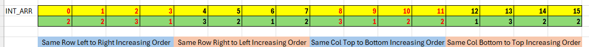
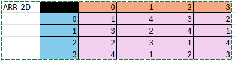
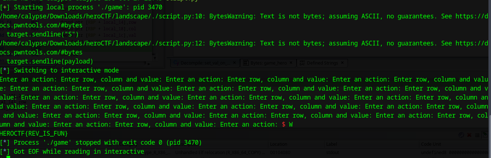

# Download The Challenge


# Ghidra Compilation
```C 
undefined8 main(void)

{
  int int_arr[16] = {2, 2, 3, 1, 3, 2, 1, 2, 3, 1, 2, 2, 1, 3, 2, 2}; // Collected From A DAT 
  char cVar1;
  char action;
  int val;
  undefined4 col;
  int row;
  int arr [4] [4];
  
  setbuf(stdout,(char *)0x0);
  setbuf(stdin,(char *)0x0);
  arr[0][0] = 0;
  arr[0][1] = 0;
  arr[0][2] = 0;
  arr[0][3] = 0;
  arr[1][0] = 0;
  arr[1][1] = 0;
  arr[1][2] = 0;
  arr[1][3] = 0;
  arr[2][0] = 0;
  arr[2][1] = 0;
  arr[2][2] = 0;
  arr[2][3] = 0;
  arr[3][0] = 0;
  arr[3][1] = 0;
  arr[3][2] = 0;
  arr[3][3] = 0;
  while( true ) {
    printf("Enter an action: ");
    __isoc99_scanf(&DAT_00102032,&action);
    if ((action == 'q') || (action == 'Q')) break;
    if ((action == 'w') || (action == 'W')) {
      cVar1 = final_flag_validator((int *)arr);
      if (cVar1 != '\0') {
        fetch_flag_from_env();
        return 0;
      }
      puts("Not today!");
    }
    else if ((action == 's') || (action == 'S')) {
      printf("Enter row, column and value: ");
      __isoc99_scanf("%d %d %d",&row,&col,&val);
      cVar1 = row_col_validator(row,col);
      if ((cVar1 == '\0') || (cVar1 = value_validator(val), cVar1 == '\0')) {
        puts("Invalid value or coordinates!");
      }
      else {
        set_val_on_row_col_element((int *)arr,row,col,val);
      }
    }
  }
  puts("Quitting...");
  return 0;
}

int flag_validator_charlie(int param_1[4][4])
{
  int i;
  int prev_elem;
  int k;
  int idx;

  idx = 0;
  while(1==1) {
    if (3 < idx) {
      return 1;
    }
    k = 0;
    prev_elem = 0;
    for (i = 0; i < 4; i = i + 1) {
      if (param_1[idx][i] > prev_elem) {
        prev_elem = param_1[idx][i];
        k = k + 1;
      }
    }
    if (k != int_arr[idx]) break;
    idx = idx + 1;
  }
  return 0;
}


int flag_validator_delta(int arr[4][4])
{
  int j;
  int val;
  int k;
  int i;

  i = 0;
  while( 1==1 ) {
    if (3 < i) {
      return 1;
    }
    k = 0;
    val = 0;
    for (j = 3; j>=0; j = j-1) {
      if (arr[i][j] > val) {
        val = arr[i][j];
        k = k + 1;
      }
    }
    if (k != int_arr[i + 4]) break;
    i = i + 1;
  }
  return 0;
}

int flag_validator_echo(int param_1[4][4])

{
  int i;
  int val;
  int idx;
  int k;

  k = 0;
  while( 1==1 ) {
    if (k>3) {
      return 1;
    }
    idx = 0;
    val = 0;
    for (i = 0; i < 4; i = i + 1) {
      if (param_1[i][k]> val) {
        val = param_1[i][k];
        idx = idx + 1;
      }
    }
    if (idx != int_arr[k + 8]) break;
    k = k + 1;
  }
  return 0;
}


int flag_validator_frank(int param_1[4][4])

{
  int i;
  int val;
  int k;
  int idx;

  idx = 0;
  while( 1==1 ) {
    if (3 < idx) {
      return 1;
    }
    k = 0;
    val = 0;
    for (i = 3; -1 < i; i = i + -1) {
      if (param_1[i][idx] > val) {
        val = param_1[i][idx];
        k = k + 1;
      }
    }
    if (k != int_arr[idx + 12]) break;
    idx = idx + 1;
  }
  return 0;
}

int flag_validator_alpha(int arr[4][4])

{
  int k;
  int j;
  int i;
  int idx;

  idx = 0;
  do {
    if (3 < idx) {
      return 1;
    }
    for (i = 0; i < 3; i = i + 1) {
      for (j = 0; j < 4; j = j + 1) {
        if ((i != j) && (arr[idx][i] == arr[idx][j])) {
          return 0;
        }
      }
      for (k = 0; k < 4; k = k + 1) {
        if ((idx != k) && (arr[idx][i] == arr[k][i])) {
          return 0;
        }
      }
    }
    idx = idx + 1;
  } while( 1==1 );
}

int flag_validator_bravo(int param_1[4][4])

{
  char cVar1;

  cVar1 = flag_validator_charlie(param_1);
  if ((((cVar1 != '\0') && (cVar1 = flag_validator_delta(param_1), cVar1 != '\0')) &&
      (cVar1 = flag_validator_echo(param_1), cVar1 != '\0')) &&
     (cVar1 = flag_validator_frank(param_1), cVar1 != '\0')) {
    return 1;
  }
  return 0;
}


int validate_non_zero_only(int arr[4][4])
{
  int j;
  int i;

  i = 0;
  do {
    if (3 < i) {
      return 1;
    }
    for (j = 0; j < 4; j = j + 1) {
      if (arr[i][j] == 0) {
        return 0;
      }
    }
    i = i + 1;
  } while( 1==1 );
}

int final_flag_validator(int arr[4][4])
{
  char cVar1;

  cVar1 = validate_non_zero_only(arr);
  if (((cVar1 != '\0') && (cVar1 = flag_validator_alpha(arr), cVar1 != '\0')) &&
     (cVar1 = flag_validator_bravo(arr), cVar1 != '\0')) {
    return 1;
  }
  return 0;
}

void fetch_flag_from_env(void)
{
  char *__s;
  
  __s = getenv("FLAG");
  if (__s == (char *)0x0) {
    puts("Flag is undefined!");
  }
  else {
    puts(__s);
  }
  return;
}

undefined4 row_col_validator(int row,int col)
{
  undefined4 uVar1;
  
  if ((((row < 0) || (3 < row)) || (col < 0)) || (3 < col)) {
    uVar1 = 0;
  }
  else {
    uVar1 = 1;
  }
  return uVar1;
}

void set_val_on_row_col_element(int *2d_array,int row,int col,int val)
{
  2d_array[(long)row * 4 + (long)col] = val;
  return;
}
```
# Insight
- **flag_validator_charlie:** Checks each row to ensure a specific number of elements are in increasing order, matching values in int_arr for each row.
- **flag_validator_delta:** Checks each row to ensure that each row has their elements in increasing order, but right to left, for a number of time matching values in int_arr for each corresponding row
- **flag_validator_echo:** Ensures a certain number of elements in each column are in increasing order.
- **flag_validator_frank:** Ensure a certain number of element in each column are in increasing order from bottom to top.
- **flag_validator_alpha:** Ensures that each row and column have unique, non-repeating numbers.
- **validate_non_zero_only:** Ensures all elements in the matrix are non-zero.

# Visualization of The Array


# Acceptable Array 
After manually playing with numbers, I have found the following array acceptable according to the constraints enforced by the aforementioned functions:



# Script
```python
#!/bin/python3

from pwn import *

target = process("./game")
arr = [[1, 4, 3, 2], [3, 2, 4, 1], [2, 3, 1, 4], [4, 1, 2, 3]]
#print(target.recvline())
for i in range(4):
	for j in range(4):
		target.sendline("S")
		payload = f"{i} {j} {arr[i][j]}"
		target.sendline(payload)
target.interactive()
```

# Final Demonstration
Firstly, let's set the environment variable
```bash
export FLAG="HEROCTF{REV_IS_FUN}"
```


