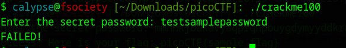
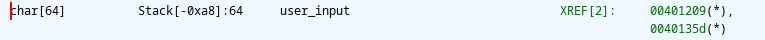
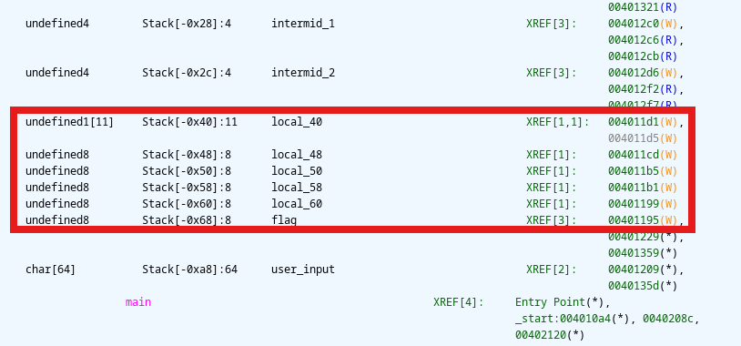
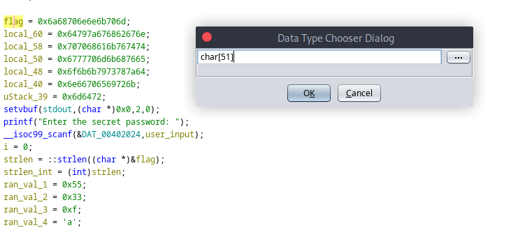
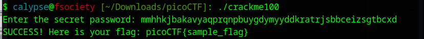
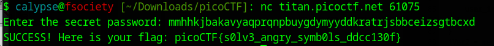

# Prompt

# Ghidra Decompilation
```C 
undefined8 main(void)

{
  int iVar1;
  size_t sVar2;
  char local_a8 [64];
  undefined8 local_68;
  undefined8 local_60;
  undefined8 local_58;
  undefined8 local_50;
  undefined8 local_48;
  undefined7 local_40;
  undefined4 uStack_39;
  uint local_2c;
  uint local_28;
  char local_21;
  uint local_20;
  uint local_1c;
  uint local_18;
  int local_14;
  int local_10;
  int local_c;
  
  local_68 = 0x6a68706e6e6b706d;
  local_60 = 0x64797a676862676e;
  local_58 = 0x707068616b767474;
  local_50 = 0x6777706d6b687665;
  local_48 = 0x6f6b6b7973787a64;
  local_40 = 0x6e66706569726b;
  uStack_39 = 0x6d6472;
  setvbuf(stdout,(char *)0x0,2,0);
  printf("Enter the secret password: ");
  __isoc99_scanf(&DAT_00402024,local_a8);
  local_c = 0;
  sVar2 = strlen((char *)&local_68);
  local_14 = (int)sVar2;
  local_18 = 0x55;
  local_1c = 0x33;
  local_20 = 0xf;
  local_21 = 'a';
  for (; local_c < 3; local_c = local_c + 1) {
    for (local_10 = 0; local_10 < local_14; local_10 = local_10 + 1) {
      local_28 = (local_10 % 0xff >> 1 & local_18) + (local_10 % 0xff & local_18);
      local_2c = ((int)local_28 >> 2 & local_1c) + (local_1c & local_28);
      iVar1 = ((int)local_2c >> 4 & local_20) +
              ((int)local_a8[local_10] - (int)local_21) + (local_20 & local_2c);
      local_a8[local_10] = local_21 + (char)iVar1 + (char)(iVar1 / 0x1a) * -0x1a;
    }
  }
  iVar1 = memcmp(local_a8,&local_68,(long)local_14);
  if (iVar1 == 0) {
    printf("SUCCESS! Here is your flag: %s\n","picoCTF{sample_flag}");
  }
  else {
    puts("FAILED!");
  }
  return 0;
}
```

Let's rename some variables for our convenience
```C
  printf("Enter the secret password: ");
  __isoc99_scanf(&DAT_00402024,user_input);
  i = 0;
  strlen = ::strlen((char *)&flag);
  strlen_int = (int)strlen;
  ran_val_1 = 0x55;
  ran_val_2 = 0x33;
  ran_val_3 = 0xf;
  ran_val_4 = 'a';
  for (; i < 3; i = i + 1) {
    for (j = 0; j < strlen_int; j = j + 1) {
      intermid_1 = (j % 0xff >> 1 & ran_val_1) + (j % 0xff & ran_val_1);
      intermid_2 = (intermid_1 >> 2 & ran_val_2) + (ran_val_2 & intermid_1);
      alpha_order = (intermid_2 >> 4 & ran_val_3) +
                    ((int)usr_input[j] - (int)ran_val_4) + (ran_val_3 & intermid_2);
      usr_input[j] = ran_val_4 + (char)alpha_order + (char)(alpha_order / 0x1a) * -0x1a;
    }
  }
```

If we take a look at the main function in the Listing View:
```
                             **************************************************************
                             *                          FUNCTION                          *
                             **************************************************************
                             undefined main()
             undefined         AL:1                <RETURN>                                XREF[1]:     00401230(W)  
             undefined8        RAX:8               strlen                                  XREF[1]:     00401230(W)  
             undefined4        Stack[-0xc]:4       i                                       XREF[3]:     00401222(W), 
                                                                                                        00401345(RW), 
                                                                                                        00401349(R)  
             undefined4        Stack[-0x10]:4      j                                       XREF[7]:     00401256(W), 
                                                                                                        00401262(R), 
                                                                                                        0040128f(R), 
                                                                                                        004012d9(R), 
                                                                                                        00401329(R), 
                                                                                                        00401335(RW), 
                                                                                                        00401339(R)  
             undefined4        Stack[-0x14]:4      strlen_int                              XREF[3]:     00401235(W), 
                                                                                                        0040133c(R), 
                                                                                                        00401353(R)  
             undefined4        Stack[-0x18]:4      ran_val_1                               XREF[3]:     00401238(W), 
                                                                                                        0040128c(R), 
                                                                                                        004012bb(R)  
             undefined4        Stack[-0x1c]:4      ran_val_2                               XREF[3]:     0040123f(W), 
                                                                                                        004012c3(R), 
                                                                                                        004012d1(R)  
             undefined4        Stack[-0x20]:4      ran_val_3                               XREF[3]:     00401246(W), 
                                                                                                        004012ef(R), 
                                                                                                        004012fd(R)  
             undefined1        Stack[-0x21]:1      ran_val_4                               XREF[3]:     0040124d(W), 
                                                                                                        004012e9(R), 
                                                                                                        00401321(R)  
             undefined4        Stack[-0x28]:4      local_28                                XREF[3]:     004012c0(W), 
                                                                                                        004012c6(R), 
                                                                                                        004012cb(R)  
             undefined4        Stack[-0x2c]:4      local_2c                                XREF[3]:     004012d6(W), 
                                                                                                        004012f2(R), 
                                                                                                        004012f7(R)  
             undefined1[11]    Stack[-0x40]:11     local_40                                XREF[1,1]:   004011d1(W), 
                                                                                                        004011d5(W)  
             undefined8        Stack[-0x48]:8      local_48                                XREF[1]:     004011cd(W)  
             undefined8        Stack[-0x50]:8      local_50                                XREF[1]:     004011b5(W)  
             undefined8        Stack[-0x58]:8      local_58                                XREF[1]:     004011b1(W)  
             undefined8        Stack[-0x60]:8      local_60                                XREF[1]:     00401199(W)  
             undefined8        Stack[-0x68]:8      flag                                    XREF[3]:     00401195(W), 
                                                                                                        00401229(*), 
                                                                                                        00401359(*)  
             undefined1[64]    Stack[-0xa8]:64     user_input                              XREF[2]:     00401209(*), 
                                                                                                        0040135d(*)  
                             main                                            XREF[4]:     Entry Point(*), 
                                                                                          _start:004010a4(*), 0040208c, 
                                                                                          00402120(*)  
```

So our user input is 64 char long. Let's edit `user_input` using Ctrl+L and change it to `char[64]` .

After Editting the Variable Type:



Now let's rename to intermediary variables in the loop
```C
  for (; i < 3; i = i + 1) {
    for (j = 0; j < strlen_int; j = j + 1) {
      intermid_1 = (j % 0xff >> 1 & ran_val_1) + (j % 0xff & ran_val_1);
      intermid_2 = ((int)intermid_1 >> 2 & ran_val_2) + (ran_val_2 & intermid_1);
      iVar1 = ((int)intermid_2 >> 4 & ran_val_3) +
              ((int)user_input[j] - (int)ran_val_4) + (ran_val_3 & intermid_2);
      user_input[j] = ran_val_4 + (char)iVar1 + (char)(iVar1 / 0x1a) * -0x1a;
    }
  }
```

Now we can see our flag string:


This is actually not the actual flag. It's rather an encrypted version of the flag.
In any case, we can calculate the length of the encrypted flag. 
length of the encrypted flag = 8*5+11=51 bytes

Now let's adjust the encrypted flag in our Ghidra Decompiler. Pressing Ctrl+L on flag variable, we will rename `char[51]`



After editting,
```C
  flag[0] = 'm';
  flag[1] = 'p';
  flag[2] = 'k';
  flag[3] = 'n';
  flag[4] = 'n';
  flag[5] = 'p';
  flag[6] = 'h';
  flag[7] = 'j';
  flag[8] = 'n';
  flag[9] = 'g';
  flag[10] = 'b';
  flag[11] = 'h';
  flag[12] = 'g';
  flag[13] = 'z';
  flag[14] = 'y';
  flag[15] = 'd';
  flag[16] = 't';
  flag[17] = 't';
  flag[18] = 'v';
  flag[19] = 'k';
  flag[20] = 'a';
  flag[21] = 'h';
  flag[22] = 'p';
  flag[23] = 'p';
  flag[24] = 'e';
  flag[25] = 'v';
  flag[26] = 'h';
  flag[27] = 'k';
  flag[28] = 'm';
  flag[29] = 'p';
  flag[30] = 'w';
  flag[31] = 'g';
  flag[32] = 'd';
  flag[33] = 'z';
  flag[34] = 'x';
  flag[35] = 's';
  flag[36] = 'y';
  flag[37] = 'k';
  flag[38] = 'k';
  flag[39] = 'o';
  flag[40] = 'k';
  flag[41] = 'r';
  flag[42] = 'i';
  flag[43] = 'e';
  flag[44] = 'p';
  flag[45] = 'f';
  flag[46] = 'n';
  flag[47] = 'r';
  flag[48] = 'd';
  flag[49] = 'm';
  flag[50] = '\0';
```

So this is the encrypted flag! We can confirm it by taking a peek at the last byte `flag[50] = '\0';`
It's a null byte that represents the end of a string.

We have another interesting portion of the code to have a look at:
```C
user_input[j] = ran_val_4 + (char)iVar2 + (char)(iVar2 / 0x1a) * -0x1a;
```
It is the last line of the for loop. Looks really messy, right? But don't worry! I am here to help you understand the code.

Ignore the `ran_val_4` variable for now and take consider only `(char)iVar2 + (char)(iVar2 / 0x1a) * -0x1a`.
Can you simplify it? 

Here we are dividing `iVar2` by 0x1a or 26 in decimal and then multiplying it by the same value(0x1a). Then we subtracted the result from `iVar2`.

If you are confused, it's time to remember the old formula:

`dividend = divisor x quotient + remainder` <br>
`(char)(iVar2 / 0x1a) * -0x1a` is basically `-divisor*quotient` and `iVar2` itself is the `divident`. So basically the code `(char)iVar2 + (char)(iVar2 / 0x1a) * -0x1a` tries to find the remainder of the variable `iVar2`.

We can rewrite the whole code as,
```C
user_input[j] = ran_val_4 + (iVar2 % 26)
```

The given value of `ran_val_4` was `a` which is the first letter of the alphabet. So in this code, first we are finding the value of `iVar2` in the boundary of 26 and then adding `a` to the value. Do you understand what it means?

`iVar2` represents each lowercase character in the alphabet! That's why it is modded by 26.
Here,
```
a=0
b=1
c=2
...
z=25
```

When we add `ran_val_4` to `iVar2`, we receive the ASCII representation of that character.
```
a=97
b=98
c=99
...
z=122
```
So we should rename `iVar2` to `alpha_order`.

Now that we have successfully analyzed the decompiled code, we can stretch ourselves a little bit and write a cute little script that will fetch the `password` (We thought it was the `flag`. But in reality, it was the unencrypted version of the password).

```python
stored_encrypted_flag = [None for i in range(50)] # We need 50 characters if we exclude the null byte
stored_encrypted_flag[0] = 'm'
stored_encrypted_flag[1] = 'p'
stored_encrypted_flag[2] = 'k'
stored_encrypted_flag[3] = 'n'
stored_encrypted_flag[4] = 'n'
stored_encrypted_flag[5] = 'p'
stored_encrypted_flag[6] = 'h'
stored_encrypted_flag[7] = 'j'
stored_encrypted_flag[8] = 'n'
stored_encrypted_flag[9] = 'g'
stored_encrypted_flag[10] = 'b'
stored_encrypted_flag[11] = 'h'
stored_encrypted_flag[12] = 'g'
stored_encrypted_flag[13] = 'z'
stored_encrypted_flag[14] = 'y'
stored_encrypted_flag[15] = 'd'
stored_encrypted_flag[16] = 't'
stored_encrypted_flag[17] = 't'
stored_encrypted_flag[18] = 'v'
stored_encrypted_flag[19] = 'k'
stored_encrypted_flag[20] = 'a'
stored_encrypted_flag[21] = 'h'
stored_encrypted_flag[22] = 'p'
stored_encrypted_flag[23] = 'p'
stored_encrypted_flag[24] = 'e'
stored_encrypted_flag[25] = 'v'
stored_encrypted_flag[26] = 'h'
stored_encrypted_flag[27] = 'k'
stored_encrypted_flag[28] = 'm'
stored_encrypted_flag[29] = 'p'
stored_encrypted_flag[30] = 'w'
stored_encrypted_flag[31] = 'g'
stored_encrypted_flag[32] = 'd'
stored_encrypted_flag[33] = 'z'
stored_encrypted_flag[34] = 'x'
stored_encrypted_flag[35] = 's'
stored_encrypted_flag[36] = 'y'
stored_encrypted_flag[37] = 'k'
stored_encrypted_flag[38] = 'k'
stored_encrypted_flag[39] = 'o'
stored_encrypted_flag[40] = 'k'
stored_encrypted_flag[41] = 'r'
stored_encrypted_flag[42] = 'i'
stored_encrypted_flag[43] = 'e'
stored_encrypted_flag[44] = 'p'
stored_encrypted_flag[45] = 'f'
stored_encrypted_flag[46] = 'n'
stored_encrypted_flag[47] = 'r'
stored_encrypted_flag[48] = 'd'
stored_encrypted_flag[49] = 'm'
usr_input = stored_encrypted_flag # Since we are running the reverse algorithm. We will pass the encrypted flag(actually the encrypted password) as the user input
strlen_int = len(stored_encrypted_flag)
ran_val_1 = 0x55
ran_val_2 = 0x33
ran_val_3 = 0xf
ran_val_4 = 'a'


for i in range(3):
    for j in range(strlen_int):
        alpha_order = ord(usr_input[j]) - 97 
        intermid_1 = (((j % 0xff) >> 1) & ran_val_1) + ((j % 0xff) & ran_val_1)
        intermid_2 = ((intermid_1 >> 2) & ran_val_2) + (ran_val_2 & intermid_1)
        part1 = ((intermid_2 >> 4) & ran_val_3)
        part2 = (ran_val_3 & intermid_2)
        usr_input[j] = chr(((alpha_order - part1 - part2) % 26) + 97)

flag = ""
for i in range(len(usr_input)):
    flag += usr_input[i]
print(flag)
```

Our Output:
```
mmhhkjbakavyaqprqnpbuygdymyyddkratrjsbbceizsgtbcxd

Process finished with exit code 0
```
So we got the `password`!

Let's try now:


So our `password` was correct! But it is a sample flag retrieved from the local program. Let's retrieve the actual flag from the remote server using `netcat`:


We have successfully retrieved the flag. Our hard work led to a happy ending. Lots of applause for staying with me.